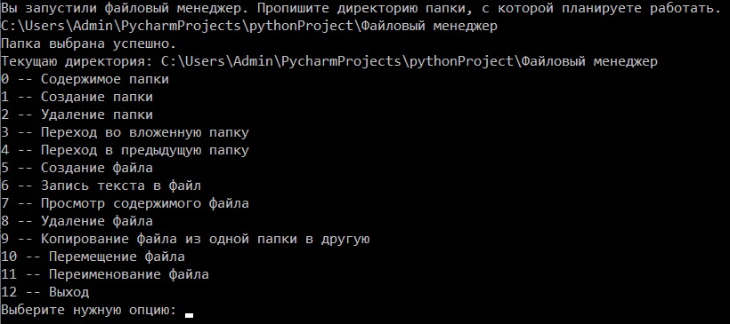

# Лабораторная работа 1. Файловый менеджер

## Цель лабораторной работы
Научиться создавать сложный проект и научиться программно работать с локальными файлами и папками.

## Задания для выполнения
Необходимо создать примитивный файловый менеджер. Программа должна работать в определенной папке (рабочей папки менеджера) и позволять пользователю выполнять следующие простые действия в пределах рабочей папки:

1. Создание папки (с указанием имени);
2. Удаление папки по имени;
3. Перемещение между папками (в пределах рабочей папки) - заход в папку по имени, выход на уровень вверх;
4. Создание пустых файлов с указанием имени;
5. Запись текста в файл;
6. Просмотр содержимого текстового файла;
7. Удаление файлов по имени;
8. Копирование файлов из одной папки в другую;
9. Перемещение файлов;
10. Переименование файлов.

